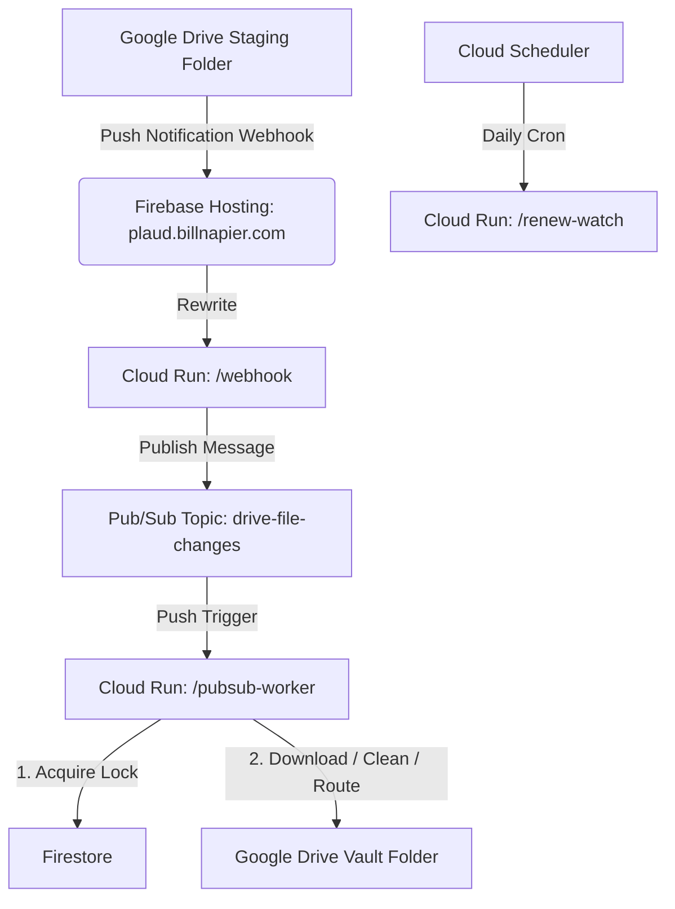

# Plaud Transcript Processor

A serverless automated pipeline that processes audio transcript files from an **Obsidian Staging** folder in Google Drive, cleans/normalizes the transcript text, classifies the content, and routes them into a structured **Obsidian Vault** folder.

## Architecture

The system is built as a serverless pipeline on Google Cloud Platform:

### Components

*   **Google Drive API**: Webhook push notifications track changes in `Obsidian Staging`.
*   **Firebase Hosting**: Custom domain rewrite routing (`plaud.billnapier.com`) to Cloud Run.
*   **Cloud Run (Express server)**:
    *   `/webhook`: Receives Drive notifications and publishes to Pub/Sub immediately to avoid execution timeouts.
    *   `/pubsub-worker`: Performs distributed transaction locking via Firestore (to guarantee idempotency), downloads transcripts, cleans and formats the content, routes them, and deletes the staging file.
    *   `/renew-watch`: Automatic 24-hour Drive watch subscription renewal.
*   **Cloud Pub/Sub**: Message queue decoupling the webhook reception from the processing logic.
*   **Cloud Firestore**: Stores active watch channel metadata and ensures file-level idempotency.
*   **Cloud Scheduler**: Triggered daily to execute the watch channel renewal job.
*   **CI/CD Pipeline**: GitHub Actions automatically build, push Docker containers to Artifact Registry, and run Terraform on push to `main`.

---

## Post-Deployment Setup Steps

To activate the pipeline and ensure file events flow correctly, the following two configuration steps must be completed:

### 1. Share Google Drive Folders
Because the application runs under a dedicated service account identity, it cannot view your personal files by default.
*   In Google Drive, locate your **`Obsidian Staging`** and **`Obsidian Vault`** folders.
*   Right-click each folder $\rightarrow$ **Share**.
*   Invite the service account email as an **Editor**:
    `app-runner@obsidian-sync-498904.iam.gserviceaccount.com`

### 2. Configure DNS CNAME Record
To allow Google Drive push notifications to resolve and reach the Cloud Run webhook endpoint, map your custom domain:
*   Access your domain registrar's DNS settings (e.g., Namecheap, Registrar-Servers).
*   Add a **CNAME** record:
    *   **Host / Name**: `plaud` (for `plaud.billnapier.com`)
    *   **Target / Value**: `obsidian-sync-498904.web.app`

---

## Deployment & CI/CD
The project uses GitHub Actions and Terraform to deploy infrastructure and code updates.
*   Pushing to the `main` branch triggers the deployment workflow.
*   It logs in to GCP via Workload Identity Federation (WIF), builds and registers the Docker image to Artifact Registry, and runs `terraform apply` to deploy updates to Cloud Run.
