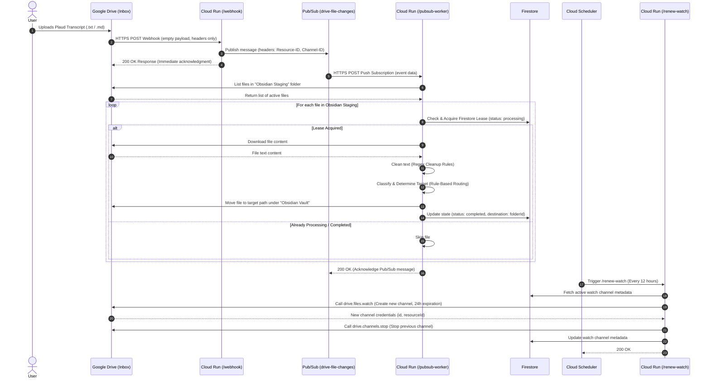
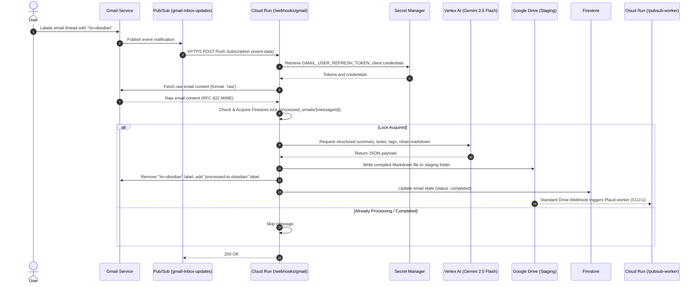
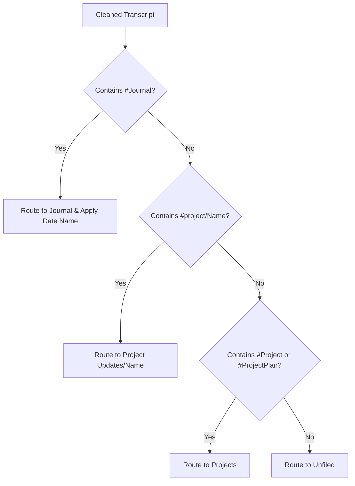
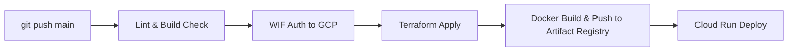

# Detailed Design: Plaud Transcript Processor & Router

This document details the software architecture, data flows, database schemas, and infrastructure blueprint for the Plaud Transcript Processor and Router. It incorporates the rule-based logic and text cleaning rules migrated from the legacy Google Apps Script.

---

## 1. System Architecture & Components

The system is designed as a decoupled, 100% serverless application deployed on **Google Cloud Platform (GCP)** within the free-tier limits where possible. It supports two independent entry points for automated ingestion, which converge at the `Obsidian Staging` folder in Google Drive:

1. **PLAUD Transcripts:** Detects new transcripts uploaded to Google Drive, cleans them, and routes them based on tags.
2. **Gmail Ingestion:** Processes emails labeled with `!to-obsidian`, uses **Gemini 2.5 Flash** (via Vertex AI) for structured metadata extraction, compiles them to Markdown, and writes them to the staging folder.

### Folder Infrastructure (Google Drive)
* **Staging Folder:** `Obsidian Staging` (Inbox where new transcript/captured files are uploaded).
* **Destination Root Folder:** `Obsidian Vault` (Target parent folder where processed files are organized).

### Architectural Sequence: PLAUD Transcripts


### Architectural Sequence: Gmail & LLM Ingestion


---

## 2. API Endpoint Specification

The Cloud Run service is implemented as a single Node.js/Express service exposing three HTTP endpoints. All endpoints run under SSL and route through Firebase Hosting.

### 2.1. `POST /webhook`
* **Visibility:** Public (Accessible to Google Drive API IP ranges).
* **Payload:** Empty request body. Event parameters are read from incoming request headers:
  * `x-goog-channel-id`: Unique identifier of the notification channel.
  * `x-goog-resource-id`: Identifier of the resource being watched (the `Obsidian Staging` folder).
  * `x-goog-resource-state`: The state change (e.g., `add`, `update`, `trash`).
* **Behavior:**
  1. Extract headers. If `x-goog-resource-state` is `sync` (channel verification event), log and respond immediately with `200 OK`.
  2. If the state is `add` or `update`, publish a message to the Pub/Sub topic `drive-file-changes` containing the header details. (Note: Secret token validation on the header is skipped in this phase for simpler deployment).
  3. Respond with `200 OK` within $<500\text{ms}$ to prevent Google Drive from marking the endpoint as degraded.

### 2.2. `POST /pubsub-worker`
* **Visibility:** Private (Secured via OIDC token verification; invokable only by the Pub/Sub Push Subscription service account).
* **Payload:** Pub/Sub envelope containing the base64-encoded event details.
* **Behavior:**
  1. Authenticate that the request has a valid Google OIDC token issued for this service.
  2. Query the Google Drive API to list all files currently in the watched `Obsidian Staging` folder.
  3. For each file:
     * Check if the mimeType is `text/plain` or if the filename ends with `.md`. Skip invalid file types.
     * Check if a document exists in Firestore under `processed_files/{fileId}` (using a simple read-then-write check).
     * If it exists with status `processing` and the timestamp is less than 15 minutes old, skip to prevent concurrent processing.
     * If it doesn't exist, create it with status `processing` and a current timestamp.
     * Download the file. Verify that the content is not empty (still syncing). If empty, release the lease and skip.
     * Apply **Regex Cleanup Rules** (see Section 4).
     * Determine destination path and filename using the **Rule-Based Routing Engine** (see Section 5).
     * Resolve target folder. If target folder name already exists in target parent, reuse its ID to prevent duplicate folder creation.
     * Check if target filename already exists in the destination folder. If it does, append an incrementing suffix (e.g. `_1.md`, `_2.md`) to maintain uniqueness.
     * Call the Google Drive API to add the target folder as a parent and remove `Obsidian Staging` as a parent.
     * Update the Firestore document to status `completed`.
  4. Respond with `200 OK` to acknowledge the Pub/Sub message.

### 2.3. `POST /renew-watch`
* **Visibility:** Private (Secured via OIDC token; invokable only by Cloud Scheduler).
* **Payload:** Empty.
* **Behavior:**
  1. Query Firestore for the currently active channel in `watch_channels/inbox_channel`.
  2. Generate a new `channelId` (UUID v4).
  3. Call `drive.files.watch` on the `Obsidian Staging` folder, specifying:
     * Address: `https://<domain>/webhook`
     * Type: `web_hook`
     * Id: `channelId`
  4. Write the new channel details to Firestore.
  5. If an old channel existed, call `drive.channels.stop` using the old `id` and `resourceId` to cleanly wind it down.
  6. Retrieve `GMAIL_USER_REFRESH_TOKEN` from Google Secret Manager. If present, initialize the Gmail client, resolve/create the `!to-obsidian` label, and call `gmail.users.watch` with topic `projects/<project-id>/topics/gmail-inbox-updates` and label filters to renew the Gmail push notification channel.
  7. Return `200 OK`.

### 2.4. `POST /webhooks/gmail`
* **Visibility:** Private (Secured via OIDC token verification; invokable only by Pub/Sub Push Subscription service account).
* **Payload:** Pub/Sub envelope containing the base64-encoded Gmail notification details.
* **Behavior:**
  1. Authenticate the request using OIDC token validation.
  2. Retrieve `GMAIL_USER_REFRESH_TOKEN` from environment/Secret Manager and authenticate Gmail client.
  3. Query Gmail for all messages matching `label:!to-obsidian`.
  4. For each discovered message:
     * Check if a document exists in Firestore under `processed_emails/{messageId}`.
     * If not already processing or completed, transactionally set the status to `processing`.
     * Fetch raw email content (`format: 'raw'`) and parse it using `mailparser` to extract subject, sender, date, body, and threadId.
     * Generate prompt and invoke **Gemini 2.5 Flash** with strict JSON output schema to obtain: `summary`, `tasks`, `tags`, and `cleanMarkdown`.
     * Enforce task generation policy: extract actionable TODOs, fallback to a standard review item if none found, biasing toward a single task.
     * Compile final Markdown note with frontmatter metadata, direct email thread link, summary, checkbox tasks, and the cleaned markdown body.
     * Append extracted tags as space-separated hashtags to the end of the note.
     * Write the compiled file to the `Obsidian Staging` folder in Google Drive (this triggers the downstream Plaud worker).
     * Call Gmail API to remove `!to-obsidian` and add `processed-to-obsidian` labels.
     * Update the Firestore document to status `completed`.
  5. Return `200 OK`.

### 2.5. `GET /auth/gmail`
* **Visibility:** Public admin endpoint.
* **Payload:** None.
* **Behavior:**
  1. Generate Google OAuth 2.0 authorization URL requesting scopes for `gmail.readonly`, `gmail.modify`, and `drive`.
  2. Set `access_type: 'offline'` and `prompt: 'consent'` to guarantee Google returns a refresh token.
  3. Redirect user's browser to Google's consent screen.

### 2.6. `GET /auth/gmail/callback`
* **Visibility:** Public admin callback endpoint.
* **Payload:** Query parameters containing the authorization `code`.
* **Behavior:**
  1. Exchange the authorization code for access and refresh tokens.
  2. Instantiate a temporary Gmail client and query `gmail.users.getProfile({ userId: 'me' })`.
  3. Extract the authenticated user's email address and compare it to the `ALLOWED_EMAIL` environment variable.
  4. If they do not match, abort with `403 Forbidden` and do not save any token.
  5. If authorized, write the permanent `refresh_token` into Google Secret Manager under the secret name `GMAIL_USER_REFRESH_TOKEN`.
  6. Return a success page to the user.

---

## 3. Database Schema (Firestore)

Firestore is used in Native mode to maintain lightweight distributed locks, track channel renewals, and guarantee exactly-once processing of email messages.

### 3.1. Collection: `watch_channels`
Stores current Google Drive watch subscriptions.

```json
{
  "id": "inbox_channel",
  "channelId": "4a7b8e19-9cf4-4e2b-b892-3023e11aa750",
  "resourceId": "z7x8y9-abc123xyz",
  "expiration": 1781683200000,          // Epoch ms (24 hours from creation)
  "createdAt": "2026-06-16T12:00:00Z",
  "updatedAt": "2026-06-16T12:00:00Z"
}
```

### 3.2. Collection: `processed_files`
Acts as a distributed lock and processing history log for Google Drive files to ensure idempotency.

```json
{
  "id": "1A2B3C4D5E6F7G8H9I0J",          // The Google Drive fileId
  "status": "processing" | "completed" | "failed",
  "fileName": "Meeting_Notes_2026-06-16.txt",
  "classification": "Journal" | "Project Updates/FooBar" | "Projects" | "Unfiled",
  "destinationFolderId": "0B123_xyz...", // Target Google Drive folder ID
  "error": null | "Error description text",
  "lockedAt": "2026-06-16T12:05:01Z",
  "completedAt": "2026-06-16T12:05:08Z"
}
```

### 3.3. Collection: `processed_emails`
Acts as a distributed lock and deduplication log for Gmail messages.

```json
{
  "id": "18f3a5b28d7c4a1e",              // The Gmail messageId
  "status": "processing" | "completed" | "failed",
  "driveFileId": "0B456_abc...",         // Google Drive file ID of the generated note
  "subject": "Fwd: Project Updates",
  "error": null | "Error description text",
  "lockedAt": "2026-07-19T03:54:42Z",
  "completedAt": "2026-07-19T03:55:10Z"
}
```

---

## 4. Regex Cleanup Rules

The transcript content downloaded by the worker must run through the following post-processing cleanups:

1. **Obsidian Tag Normalization:** Fix quotes/backticks around hashtags (e.g. `'#FooBar'` or `` `#FooBar` ``).
   * **Pattern:** `/['`](#\w+)['`]/g`
   * **Replacement:** `$1`
2. **Backtick Removal:** Strip AI-protected backticks formatting.
   * **Pattern:** `/`([^`]+)`/g`
   * **Replacement:** `$1`
3. **Date Expansion:** Standardize inline date references (e.g. `MM-DD` or `DD-MM`) into fully qualified `YYYY-MM-DD` using the current year.
   * **Pattern:** `/(?<!\d{4}-)\b(\d{2})-(\d{2})\b/g`
   * **Replacement:** `${currentYear}-$1-$2`

---

## 5. Rule-Based Routing Engine

The processing worker uses a deterministic, tag-based routing system to classify transcripts. 



### 5.1. Classification Tag Matches
* **Journal Entries:**
  * **Trigger:** Content contains `#Journal`
  * **Destination Folder:** `Obsidian Vault/Journal` (Created recursively if missing)
  * **Filename Resolution:**
    * If no H1 markdown title is extracted from the content, the worker attempts to replace the inline date regex `/(?<!\d{4}-)\b(\d{2})-(\d{2})\b/g` in the filename with `${currentYear}-$1-$2`.
    * If that result is empty or resolves to `.md`, it defaults to `YYYY-MM-DD Journal Note.md` using the current date.
* **Nested Projects:**
  * **Trigger:** Content matches the regex `#project\/([a-zA-Z0-9_\-]+)` (case-insensitive).
  * **Destination Folder:** `Obsidian Vault/Project Updates/<ProjectName>`
* **Flat Projects:**
  * **Trigger:** Content contains `#Project` or `#ProjectPlan`
  * **Destination Folder:** `Obsidian Vault/Projects`
* **Default Fallback:**
  * If none of the programmatic tags match, the file is routed to `Obsidian Vault/Unfiled`.

### 5.2. Filename Resolution, Date Extraction & Prepending
All processed files are renamed to include a date prefix (`YYYY-MM-DD`) and a sanitized title (e.g. `YYYY-MM-DD - <Sanitized Title>.md`).

1. **Date Resolution Hierarchy:**
   The worker resolves the target date using the following priority queue:
   * **Content Timestamp Tag:** Scans the content for a `timestamp: <value>` (or `- timestamp: <value>`) metadata line. This parses standard date strings, unix timestamps (seconds or milliseconds), or `YYYY-MM-DD` regex patterns.
   * **H1 Title Prefix:** If the extracted H1 title already starts with a `YYYY-MM-DD` date pattern, that date is extracted and used.
   * **Filename Timestamp/Date:** If the original filename is a numeric timestamp (unix epoch in seconds or milliseconds) or contains a `YYYY-MM-DD` string pattern, that date is resolved.
   * **Current Date Fallback:** If none of the above are matched, it defaults to the current date in local time (`YYYY-MM-DD`).

2. **Base Title Resolution:**
   * **Title Extraction:** The worker scans the cleaned markdown content line by line to extract the first H1 heading (the first line starting with `# `).
   * **Fallback to Original Filename:** If no H1 title is found, the worker falls back to the original filename without extension. For `#Journal` notes, inline date patterns like `MM-DD` are expanded to `YYYY-MM-DD` using the current year.
   * **Default Fallback:** If the base title resolves to an empty string, it defaults to `Plaud Note`.

3. **Sanitization & Assembly:**
   * **Sanitization:** All base titles are sanitized to ensure compatibility with Google Drive, Windows, Linux, and Obsidian Vault naming schemes. Slashes (`/` and `\`) are replaced with dashes (`-`), other invalid characters (`:`, `*`, `?`, `"`, `<`, `>`, `|`) are removed, and consecutive whitespaces are collapsed.
   * **Composition:** If the sanitized base title already starts with the resolved date (with or without dashes), it is used directly as `${baseName}.md`. Otherwise, the date is prepended to form `${fileDate} - ${baseName}.md`.
   * **De-duplication:** Google Drive natively allows multiple files with the exact same name in a single folder. However, this causes conflicts on local filesystems (e.g., synced Obsidian vaults). To prevent this, the worker checks the target destination folder before the move, listing all existing names in that directory to perform a case-insensitive match. If a collision is found, an incrementing suffix (e.g., `_1`, `_2`) is appended to the filename.

---

## 6. Gmail Ingestion & LLM Processing Engine

When a Gmail message labeled with `!to-obsidian` is detected, `/webhooks/gmail` processes the ingestion, parsing, LLM-based structured data extraction, and compiles the final note.

### 6.1. Webhook Ingestion & Deduplication
1. **Pub/Sub Trigger:** Gmail's push service fires to `gmail-inbox-updates`, triggering `/webhooks/gmail` via the Pub/Sub push subscription.
2. **Retrieve Labeled Messages:** The handler reads credentials from Secret Manager, connects to the Gmail API, and queries for all messages matching `label:!to-obsidian`.
3. **Firestore Lock & Deduplication:** For each message ID, a transaction checks the `processed_emails` collection. If the status is `completed` or `processing` (and less than 15 minutes old), the message is skipped. Otherwise, the status is set to `processing` with a lock timestamp.

### 6.2. MIME Parsing
The message payload is fetched in raw RFC 822 format and parsed using `mailparser`. The parser extracts:
* **Subject:** Falls back to `No Subject`.
* **Sender:** Extracts text representation of sender.
* **Date:** Parses email date, falling back to the current date.
* **Body:** Extracts plain text body content.
* **Link:** Constructs a direct URL to the Gmail thread: `https://mail.google.com/mail/u/0/#all/${threadId}`.

### 6.3. Gemini Orchestration & JSON Schema
The plain-text body is sent to **Gemini 2.5 Flash** (using Vertex AI via the `@google/genai` client). The model response is strictly enforced using the following JSON schema:
```typescript
const responseSchema = {
  type: 'object',
  properties: {
    summary: { type: 'string', description: 'A concise 2-3 sentence summary of the email context.' },
    tasks: {
      type: 'array',
      items: { type: 'string' },
      description: 'Action items or todo tasks extracted from the email body. You must return at least 1 task. If there are no clear tasks, provide "please review this email and take appropriate action". Bias heavily towards returning exactly 1 task unless there is a clear, explicit indication that multiple distinct tasks need to be completed.',
    },
    tags: {
      type: 'array',
      items: { type: 'string' },
      description: 'Extracted topics or folders. Example: project/updates, Journal, Project, ProjectPlan',
    },
    cleanMarkdown: {
      type: 'string',
      description: 'The email body converted to clean, reader-friendly Markdown.',
    },
  },
  required: ['summary', 'tasks', 'tags', 'cleanMarkdown'],
};
```

**Task Extraction Policy:**
* **Minimum Tasks:** Gemini must return at least 1 task. If no actionable item is found, it returns: `"please review this email and take appropriate action"`.
* **Single Task Bias:** Gemini is biased to output a single task unless multiple distinct actions are explicitly defined.

### 6.4. Document Compilation & Delivery
The service compiles a structured Markdown file using the structured JSON response:
```markdown
---
type: email-capture
sender: "<Sender Email>"
subject: "<Email Subject>"
timestamp: "<YYYY-MM-DD>"
email-link: "https://mail.google.com/mail/u/0/#all/<threadId>"
---

# <Email Subject>

## 📧 Email Details
- **Sender:** <Sender Name/Email>
- **Date:** <YYYY-MM-DD>
- **Link:** [View in Gmail](https://mail.google.com/mail/u/0/#all/<threadId>)

## 📝 Summary
<summary value from Gemini>

## ⏳ Action Items
- [ ] <task 1 from Gemini>
- [ ] <task 2 from Gemini>

---

<cleanMarkdown body from Gemini>

#<tag1> #<tag2>
```
* **Hashtags:** The extracted tags are appended as hashtags to the end of the markdown body, which allows the downstream Plaud routing engine to automatically classify and route the note once written to Google Drive.
* **Google Drive Upload:** The Markdown file is saved to the `Obsidian Staging` folder as `gmail-capture-${messageId}.md` using the authenticated user's Drive API permissions.
* **Downstream Trigger:** This write triggers the Drive Webhook `/webhook` and runs the `/pubsub-worker` to sanitize, rename, and route the file to its destination folder under `Obsidian Vault` (or `/Emails` if untagged).
* **Gmail Label Swapping:** On success, the `!to-obsidian` label is removed, and `processed-to-obsidian` is applied. The Firestore lock is updated to `completed`.

---

## 7. Infrastructure Code (Terraform)

All infrastructure is provisioned using Terraform, targeting a single GCP production project.

### 7.1. Resource Architecture
* **`google_project_service`**: Enables `run.googleapis.com`, `pubsub.googleapis.com`, `firestore.googleapis.com`, `cloudscheduler.googleapis.com`, `secretmanager.googleapis.com`, and `aiplatform.googleapis.com`.
* **`google_firestore_database`**: Created as `(default)` in Native mode.
* **`google_pubsub_topic`**:
  * Topic `drive-file-changes`: Buffers Drive changes, triggering `/pubsub-worker`.
  * Topic `gmail-inbox-updates`: Receives push events from the Gmail Service, triggering `/webhooks/gmail`.
* **`google_pubsub_subscription`**: Push subscriptions targeting `/pubsub-worker` and `/webhooks/gmail` endpoints respectively.
* **`google_pubsub_topic_iam_member`**: Grants `roles/pubsub.publisher` on `gmail-inbox-updates` to the Gmail push service account `serviceAccount:gmail-api-push@system.gserviceaccount.com`.
* **`google_secret_manager_secret`**: Provisioned secret containers:
  * `GMAIL_CLIENT_ID` (OAuth client ID)
  * `GMAIL_CLIENT_SECRET` (OAuth client secret)
  * `GMAIL_USER_REFRESH_TOKEN` (User refresh token)
* **`google_cloud_run_v2_service`**: Containerized Express service with environment variables:
  * `STAGING_FOLDER_NAME` (Defaults to `Obsidian Staging`)
  * `VAULT_FOLDER_NAME` (Defaults to `Obsidian Vault`)
  * `ALLOWED_EMAIL` (Plaintext email allowed to complete the OAuth handshake)
  * Secret bindings exposing secret keys as environment variables.
* **`google_cloud_scheduler_job`**: Cron configuration `0 */12 * * *` targeting `/renew-watch`.

### 7.2. IAM Roles & Permissions
A zero-trust model is enforced using specialized service accounts:

1. **`app-runner` (Cloud Run Runtime):**
   * `roles/datastore.user` (Access to Firestore locks/channels)
   * `roles/logging.logWriter` (Write application logs)
   * `roles/aiplatform.user` (Vertex AI access to execute Gemini models)
   * `roles/secretmanager.secretAccessor` (Access OAuth client credentials and refresh token)
   * `roles/secretmanager.secretVersionAdder` (OAuth callback adds new versions to `GMAIL_USER_REFRESH_TOKEN`)
2. **`pubsub-invoker` (Pub/Sub Push Subscription):**
   * `roles/run.invoker` (Permission to trigger `/pubsub-worker` and `/webhooks/gmail` private Cloud Run routes)
3. **`scheduler-invoker` (Cloud Scheduler Trigger):**
   * `roles/run.invoker` (Permission to trigger `/renew-watch` private Cloud Run route)

---

## 8. Deployment & CI/CD Workflow

Deployment is automated via **GitHub Actions** and **Workload Identity Federation (WIF)**, eliminating the need to store long-lived service account JSON keys.

### 8.1. Deployment Prerequisites
Before running the deployment pipeline, two external manual steps must occur:

1. **Domain Ownership Verification:**
   * Because Google Drive webhooks require the destination domain to be verified, we hook up Firebase Hosting to our Cloud Run service.
   * Verify the domain in the **Google Search Console** using the GCP Project's credentials.
2. **Google Drive Folder Sharing:**
   * Create the `Obsidian Staging` and `Obsidian Vault` folders.
   * Add the `app-runner` service account email (e.g., `app-runner@project-id.iam.gserviceaccount.com`) as an **Editor** on these folders.

### 8.2. CI/CD Pipeline Stages


1. **Lint & Typecheck:** Run local ESLint and TypeScript compilation to guarantee syntax safety.
2. **Authenticate with GCP:** Use GitHub's OIDC token to assume the deployment identity via WIF.
3. **Terraform Apply:** Update infrastructure configurations (Pub/Sub, IAM, Firestore, Cloud Scheduler).
4. **Build & Push:** Package the Node.js/Express app into a Docker container and push to GCP Artifact Registry.
5. **Deploy Service:** Deploy the newly pushed image to Cloud Run, updating environment variables.

