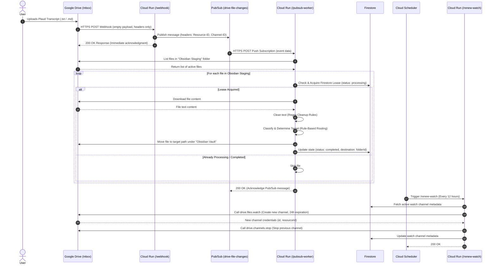
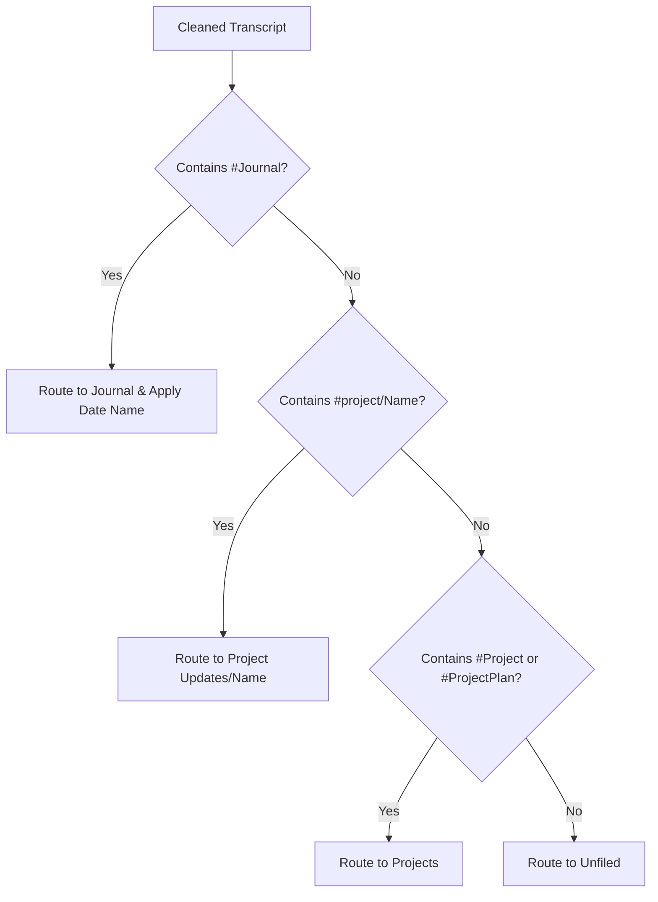
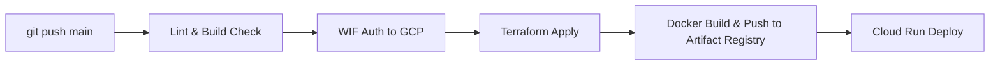

# Detailed Design: Plaud Transcript Processor & Router

This document details the software architecture, data flows, database schemas, and infrastructure blueprint for the Plaud Transcript Processor and Router. It incorporates the rule-based logic and text cleaning rules migrated from the legacy Google Apps Script.

---

## 1. System Architecture & Components

The system is designed as a decoupled, 100% serverless application deployed on **Google Cloud Platform (GCP)** within the free-tier limits where possible. It handles webhook notifications from Google Drive, buffers them via **Cloud Pub/Sub** to avoid webhook timeout limits, processes the files in a background worker, and automates watch-channel renewals via **Cloud Scheduler**.

### Folder Infrastructure (Google Drive)
* **Staging Folder:** `Obsidian Staging` (Inbox where new transcript files are uploaded).
* **Destination Root Folder:** `Obsidian Vault` (Target parent folder where processed transcripts are organized).

### Architectural Sequence



---

## 2. API Endpoint Specification

The Cloud Run service is implemented as a single Node.js/Express service exposing three HTTP endpoints. All endpoints run under SSL and route through Firebase Hosting.

### 2.1. `POST /webhook`
* **Visibility:** Public (Accessible to Google Drive API IP ranges).
* **Payload:** Empty request body. Event parameters are read from incoming request headers:
  * `x-goog-channel-id`: Unique identifier of the notification channel.
  * `x-goog-resource-id`: Identifier of the resource being watched (the `Obsidian Staging` folder).
  * `x-goog-resource-state`: The state change (e.g., `add`, `update`, `trash`).
* **Behavior:**
  1. Extract headers. If `x-goog-resource-state` is `sync` (channel verification event), log and respond immediately with `200 OK`.
  2. If the state is `add` or `update`, publish a message to the Pub/Sub topic `drive-file-changes` containing the header details. (Note: Secret token validation on the header is skipped in this phase for simpler deployment).
  3. Respond with `200 OK` within $<500\text{ms}$ to prevent Google Drive from marking the endpoint as degraded.

### 2.2. `POST /pubsub-worker`
* **Visibility:** Private (Secured via OIDC token verification; invokable only by the Pub/Sub Push Subscription service account).
* **Payload:** Pub/Sub envelope containing the base64-encoded event details.
* **Behavior:**
  1. Authenticate that the request has a valid Google OIDC token issued for this service.
  2. Query the Google Drive API to list all files currently in the watched `Obsidian Staging` folder.
  3. For each file:
     * Check if the mimeType is `text/plain` or if the filename ends with `.md`. Skip invalid file types.
     * Check if a document exists in Firestore under `processed_files/{fileId}` (using a simple read-then-write check).
     * If it exists with status `processing` and the timestamp is less than 15 minutes old, skip to prevent concurrent processing.
     * If it doesn't exist, create it with status `processing` and a current timestamp.
     * Download the file. Verify that the content is not empty (still syncing). If empty, release the lease and skip.
     * Apply **Regex Cleanup Rules** (see Section 4).
     * Determine destination path and filename using the **Rule-Based Routing Engine** (see Section 5).
     * Resolve target folder. If target folder name already exists in target parent, reuse its ID to prevent duplicate folder creation.
     * Check if target filename already exists in the destination folder. If it does, append an incrementing suffix (e.g. `_1.md`, `_2.md`) to maintain uniqueness.
     * Call the Google Drive API to add the target folder as a parent and remove `Obsidian Staging` as a parent.
     * Update the Firestore document to status `completed`.
  4. Respond with `200 OK` to acknowledge the Pub/Sub message.

### 2.3. `POST /renew-watch`
* **Visibility:** Private (Secured via OIDC token; invokable only by Cloud Scheduler).
* **Payload:** Empty.
* **Behavior:**
  1. Query Firestore for the currently active channel in `watch_channels/inbox_channel`.
  2. Generate a new `channelId` (UUID v4).
  3. Call `drive.files.watch` on the `Obsidian Staging` folder, specifying:
     * Address: `https://<domain>/webhook`
     * Type: `web_hook`
     * Id: `channelId`
  4. Write the new channel details to Firestore.
  5. If an old channel existed, call `drive.channels.stop` using the old `id` and `resourceId` to cleanly wind it down.
  6. Return `200 OK`.

---

## 3. Database Schema (Firestore)

Firestore is used in Native mode to maintain lightweight distributed locks and track channel renewals.

### 3.1. Collection: `watch_channels`
Stores current Google Drive watch subscriptions.

```json
{
  "id": "inbox_channel",
  "channelId": "4a7b8e19-9cf4-4e2b-b892-3023e11aa750",
  "resourceId": "z7x8y9-abc123xyz",
  "expiration": 1781683200000,          // Epoch ms (24 hours from creation)
  "createdAt": "2026-06-16T12:00:00Z",
  "updatedAt": "2026-06-16T12:00:00Z"
}
```

### 3.2. Collection: `processed_files`
Acts as a distributed lock and processing history log to ensure idempotency.

```json
{
  "id": "1A2B3C4D5E6F7G8H9I0J",          // The Google Drive fileId
  "status": "processing" | "completed" | "failed",
  "fileName": "Meeting_Notes_2026-06-16.txt",
  "classification": "Journal" | "Project Updates/FooBar" | "Projects" | "Unfiled",
  "destinationFolderId": "0B123_xyz...", // Target Google Drive folder ID
  "error": null | "Error description text",
  "lockedAt": "2026-06-16T12:05:01Z",
  "completedAt": "2026-06-16T12:05:08Z"
}
```

---

## 4. Regex Cleanup Rules

The transcript content downloaded by the worker must run through the following post-processing cleanups:

1. **Obsidian Tag Normalization:** Fix quotes/backticks around hashtags (e.g. `'#FooBar'` or `` `#FooBar` ``).
   * **Pattern:** `/['`](#\w+)['`]/g`
   * **Replacement:** `$1`
2. **Backtick Removal:** Strip AI-protected backticks formatting.
   * **Pattern:** `/`([^`]+)`/g`
   * **Replacement:** `$1`
3. **Date Expansion:** Standardize inline date references (e.g. `MM-DD` or `DD-MM`) into fully qualified `YYYY-MM-DD` using the current year.
   * **Pattern:** `/(?<!\d{4}-)\b(\d{2})-(\d{2})\b/g`
   * **Replacement:** `${currentYear}-$1-$2`

---

## 5. Rule-Based Routing Engine

The processing worker uses a deterministic, tag-based routing system to classify transcripts. 



### 5.1. Classification Tag Matches
* **Journal Entries:**
  * **Trigger:** Content contains `#Journal`
  * **Destination Folder:** `Obsidian Vault/Journal` (Created recursively if missing)
  * **Filename Resolution:**
    * If no H1 markdown title is extracted from the content, the worker attempts to replace the inline date regex `/(?<!\d{4}-)\b(\d{2})-(\d{2})\b/g` in the filename with `${currentYear}-$1-$2`.
    * If that result is empty or resolves to `.md`, it defaults to `YYYY-MM-DD Journal Note.md` using the current date.
* **Nested Projects:**
  * **Trigger:** Content matches the regex `#project\/([a-zA-Z0-9_\-]+)` (case-insensitive).
  * **Destination Folder:** `Obsidian Vault/Project Updates/<ProjectName>`
* **Flat Projects:**
  * **Trigger:** Content contains `#Project` or `#ProjectPlan`
  * **Destination Folder:** `Obsidian Vault/Projects`
* **Default Fallback:**
  * If none of the programmatic tags match, the file is routed to `Obsidian Vault/Unfiled`.

### 5.2. Filename Resolution & Title Extraction
1. **Title Extraction:** The worker scans the cleaned markdown content line by line to extract the first H1 heading (the first line starting with `# `).
2. **Title Sanitization:** If an H1 title is found, it is sanitized to remove or replace invalid filename characters, and is used as the base filename (appended with `.md`).
3. **Fallback Resolution:** If no H1 title is found in the content, the worker falls back to the original filename processing rules (including Journal date expansion where applicable).

### 5.3. Filename Safeguard & Sanitization
* **Invalid Characters:** In all cases (both extracted titles and fallback/original filenames), the name is sanitized to ensure compatibility with Google Drive, Windows, Linux, and Obsidian Vault naming schemes. Slashes (`/` and `\`) are replaced with dashes (`-`), and other invalid characters (`:`, `*`, `?`, `"`, `<`, `>`, `|`) are removed.
* **Empty File Name:** If the resulting filename is empty or resolves to `.md`, the worker renames the file to `Plaud Note <timestamp>.md`.

---

## 6. Infrastructure Code (Terraform)

All infrastructure is provisioned using Terraform, targeting a single GCP production project.

### 6.1. Resource Architecture
* **`google_project_service`**: Enables `run.googleapis.com`, `pubsub.googleapis.com`, `firestore.googleapis.com`, and `cloudscheduler.googleapis.com`.
* **`google_firestore_database`**: Created as `(default)` in Native mode.
* **`google_pubsub_topic`**: Topic `drive-file-changes` with a dead-letter queue configured for failures.
* **`google_pubsub_subscription`**: Push subscription targeting the Cloud Run `/pubsub-worker` endpoint.
* **`google_cloud_run_v2_service`**: The containerized Express service configured with:
  * Min instances: 0 (to stay within free tier during idle times).
  * Max instances: 2 (to limit concurrent API quotas).
  * Environment variables pointing to folder mappings and Firestore configs.
* **`google_cloud_scheduler_job`**: Cron configuration `0 */12 * * *` targeting `/renew-watch`.

### 6.2. IAM Roles & Permissions
A zero-trust model is enforced using specialized service accounts:

1. **`app-runner` (Cloud Run Runtime):**
   * `roles/datastore.user` (Access to Firestore locks/channels)
   * `roles/logging.logWriter` (Write application logs)
2. **`pubsub-invoker` (Pub/Sub Push Subscription):**
   * `roles/run.invoker` (Permission to trigger `/pubsub-worker` private Cloud Run route)
3. **`scheduler-invoker` (Cloud Scheduler Trigger):**
   * `roles/run.invoker` (Permission to trigger `/renew-watch` private Cloud Run route)

---

## 7. Deployment & CI/CD Workflow

Deployment is automated via **GitHub Actions** and **Workload Identity Federation (WIF)**, eliminating the need to store long-lived service account JSON keys.

### 7.1. Deployment Prerequisites
Before running the deployment pipeline, two external manual steps must occur:

1. **Domain Ownership Verification:**
   * Because Google Drive webhooks require the destination domain to be verified, we hook up Firebase Hosting to our Cloud Run service.
   * Verify the domain in the **Google Search Console** using the GCP Project's credentials.
2. **Google Drive Folder Sharing:**
   * Create the `Obsidian Staging` and `Obsidian Vault` folders.
   * Add the `app-runner` service account email (e.g., `app-runner@project-id.iam.gserviceaccount.com`) as an **Editor** on these folders.

### 7.2. CI/CD Pipeline Stages


1. **Lint & Typecheck:** Run local ESLint and TypeScript compilation to guarantee syntax safety.
2. **Authenticate with GCP:** Use GitHub's OIDC token to assume the deployment identity via WIF.
3. **Terraform Apply:** Update infrastructure configurations (Pub/Sub, IAM, Firestore, Cloud Scheduler).
4. **Build & Push:** Package the Node.js/Express app into a Docker container and push to GCP Artifact Registry.
5. **Deploy Service:** Deploy the newly pushed image to Cloud Run, updating environment variables.
