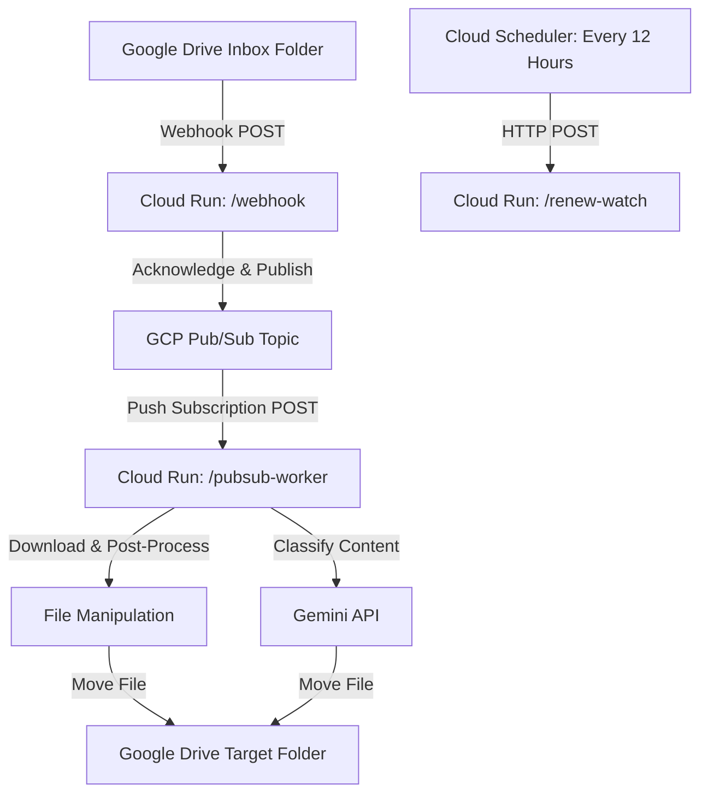

# Tech Stack & Architecture: Transcript Processor

This document defines the selected tech stack, architecture, and deployment strategy for the transcript processing and routing service. It serves as the single source of truth for future agent runs implementing this system.

---

## 1. System Overview

The system automates the ingestion, post-processing, and classification of meeting transcripts/summaries.

1. **Ingestion:** A physical device drops new transcript/summary files into a specific "Inbox" folder in Google Drive.
2. **Detection:** Google Drive sends a webhook notification to our service indicating a file was created.
3. **Cleanup:** The service reads the file, cleans the content (post-processing rules, regex cleanup), and prepares it.
4. **Classification:** The service analyzes the content (initially programmatically via rules, migrating to Gemini LLM classification) to determine the correct destination folder.
5. **Routing:** The service moves the processed file to the selected target Google Drive folder.

---

## 2. Selected Architecture: Decoupled Cloud Run + Pub/Sub

To ensure reliability, avoid timeouts from Google Drive webhooks, and maintain a 100% serverless profile within the GCP free tier, the system uses a **decoupled Cloud Run + Pub/Sub** architecture.

### Components

1. **Cloud Run Service (Production Only):**
   A single Dockerized web service (written in Node.js/TypeScript) exposing three HTTP endpoints:
   - **`POST /webhook`**
     * **Purpose:** Public endpoint registered with Google Drive's Push Notifications.
     * **Logic:** Receives the Google Drive push header notification. Extracts the channel and resource identifiers (the payload itself is empty), publishes a message containing these headers to the Pub/Sub topic, and immediately responds with `200 OK`.
   - **`POST /pubsub-worker`**
     * **Purpose:** Private endpoint triggered by a Pub/Sub Push Subscription.
     * **Logic:** Receives the message payload, calls the Google Drive API to list the files in the "Inbox" folder. For each found file:
       1. Acquires a processing lease/lock in Firestore for the `fileId`.
       2. Downloads the file content.
       3. Executes the post-processing regex text cleanup.
       4. Calls the Vertex AI Gemini API using IAM credentials (no keys) to classify the content.
       5. Moves the file to the target folder in Google Drive.
       6. Releases/updates the Firestore state.
   - **`POST /renew-watch`**
     * **Purpose:** Private endpoint triggered by Cloud Scheduler.
     * **Logic:** Establishes/renews the 24-hour Google Drive notification channel on the "Inbox" folder and stores the active `channelId` and `resourceId` in Firestore.

2. **GCP Pub/Sub Topic (`drive-file-changes`):**
   * Buffers webhook events and triggers the `/pubsub-worker` asynchronously.
   * Handles retry backoffs if the Gemini API or Google Drive API experiences temporary outages.

3. **Cloud Scheduler Job (`0 */12 * * *`):**
   * Triggers the `/renew-watch` endpoint every 12 hours. This provides a 12-hour overlap safety margin before the 24-hour Google Drive watch subscription expires.

---

## 3. Infrastructure & Deployment: Terraform

We manage all infrastructure using Terraform. The structure mirrors the single-environment, production-only pattern adapted from the `calendarsync` project.

### Terraform Files to Create
* **`terraform/main.tf`**: Enabling APIs, configuring the Artifact Registry, creating the Pub/Sub Topic and Push Subscription, creating the Cloud Run service, and provisioning Firestore database.
* **`terraform/firebase.tf`**: Configuring Firebase Hosting to rewrite custom domain requests directly to the Cloud Run service (providing free SSL and simple domain verification).
* **`terraform/iam.tf`**: Creating the custom service accounts, assigning roles (`roles/datastore.user`, `roles/aiplatform.user`, `roles/logging.logWriter`, `roles/run.invoker`, etc.), and setting up GitHub Workload Identity Federation (WIF).
* **`terraform/scheduler.tf`**: Provisioning the Cloud Scheduler job and granting scheduler permission to trigger the Cloud Run endpoint.
* **`terraform/variables.tf`** and **`terraform/terraform.tfvars`**: Declaring environment variables (project ID, region, custom domain).

### Key Configurations
* **No Staging Environment:** The deployment targets a single production GCP project.
* **Workload Identity Federation (WIF):** Authenticates the GitHub Actions runner against GCP without managing long-lived Service Account keys.
* **Service Accounts:**
  * `app-runner`: Runs the Cloud Run instance. Requires permissions to access Google Drive API, Firestore (`roles/datastore.user`), Vertex AI (`roles/aiplatform.user`), and logging.
  * `pubsub-invoker`: Impersonated by Pub/Sub to call the `/pubsub-worker` endpoint securely.
  * `scheduler-invoker`: Impersonated by Cloud Scheduler to call the `/renew-watch` endpoint.

---

## 4. Google Drive Specific Requirements

For the integration to work seamlessly, the following must be set up:

1. **Domain Verification:** 
   Google Drive will only send push notifications to verified domains.
   - A custom domain must be verified via Google Search Console.
   - Custom domains will route to the Cloud Run service using **Firebase Hosting** rewrites.
2. **Service Account Sharing:**
   - The GCP `app-runner` service account email must be added as a shared user (with Reader/Writer permissions) on the source Inbox folder and target destination folders.

---

## 5. Future Implementation Guidelines

When writing the application code:
* **Runtime:** Use Node.js and TypeScript.
* **Gemini SDK:** Use the official `@google/genai` (Node.js) client configured to use **Vertex AI** via application default credentials (`aiplatform.user` IAM role).
* **Structured Outputs:** Enforce a JSON schema on Gemini classification calls so the model strictly returns one of the predefined folder names/IDs.
* **State & Loop Management:** 
  - Since the watch channel is established *only* on the Inbox folder, events are triggered by additions and moves/deletions.
  - The worker must query the files currently inside the Inbox folder. If no files exist (e.g. after a file has been successfully moved out of the Inbox), the worker exits gracefully.
  - Firestore must be updated with the `fileId` state to lock files currently processing, preventing duplicate runs from concurrent Pub/Sub retries.
