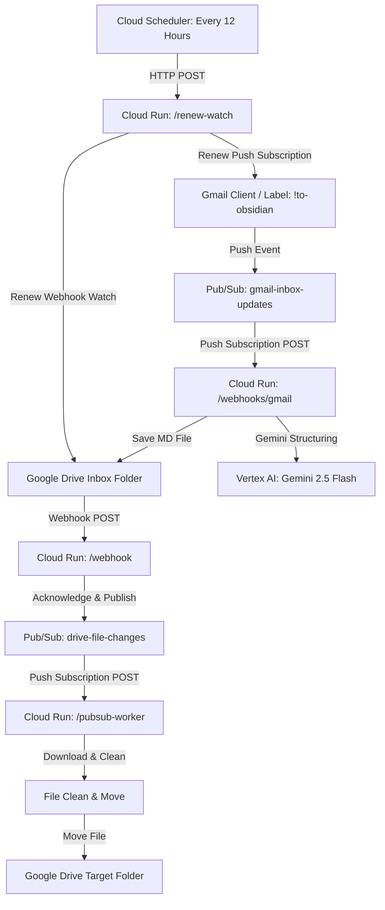

# Tech Stack & Architecture: Transcript Processor

This document defines the selected tech stack, architecture, and deployment strategy for the transcript processing and routing service. It serves as the single source of truth for future agent runs implementing this system.

---

## 1. System Overview

The system automates the ingestion, post-processing, and classification of two distinct streams of personal data:

1. **PLAUD Transcripts:** Audio transcript/summary files are captured and uploaded to a staging folder in Google Drive. They are detected via webhooks, cleaned up using regex rules, and routed based on hashtags to appropriate vault subfolders.
2. **Gmail Ingestion:** Labeled email threads (using the `!to-obsidian` label) are detected in real-time, routed through **Gemini 2.5 Flash** (via Vertex AI) for automated summarization, task extraction, and tag identification, compiled into structured Markdown notes, and placed into the same Google Drive staging folder (where they are recursively processed and routed by the Plaud worker).

---

## 2. Selected Architecture: Decoupled Cloud Run + Pub/Sub

To ensure reliability, avoid timeouts from API webhooks, and maintain a 100% serverless profile within the GCP free tier, the system uses a **decoupled Cloud Run + Pub/Sub** architecture.

### Components

1. **Cloud Run Service (Production Only):**
   A single Dockerized web service (written in Node.js/TypeScript) exposing the following HTTP endpoints:
   - **`POST /webhook`**
     * **Purpose:** Public endpoint registered with Google Drive's Push Notifications.
     * **Logic:** Receives the Google Drive push header notification. Extracts the channel and resource identifiers (the payload itself is empty), publishes a message containing these headers to the Pub/Sub topic `drive-file-changes`, and immediately responds with `200 OK`.
   - **`POST /pubsub-worker`**
     * **Purpose:** Private endpoint triggered by a Pub/Sub Push Subscription on `drive-file-changes`.
     * **Logic:** Receives the message payload, calls the Google Drive API to list the files in the staging folder. For each found file:
       1. Acquires a processing lease/lock in Firestore for the `fileId` (using a simple read-then-write check).
       2. Downloads the file content.
       3. Executes the post-processing regex text cleanup.
       4. Classifies the content programmatically using rule-based/regex routing rules.
       5. Renames the file by combining a resolved date (extracted from content timestamp, title prefix, original filename timestamp/date, or current date fallback) and a sanitized base title (extracted from the first H1 markdown heading, or fallback original name). Prepend date if not already present. Sanitizes illegal characters for Google Drive compatibility. Performs a case-insensitive check of existing filenames in the destination folder to append an incrementing suffix (e.g. `_1`) if there is a collision.
       6. Moves the file to the target folder in Google Drive.
       7. Releases/updates the Firestore state.
   - **`POST /webhooks/gmail`**
     * **Purpose:** Private endpoint triggered by a Pub/Sub Push Subscription on `gmail-inbox-updates`.
     * **Logic:** Triggered by updates to the labeled Gmail thread. Fetches the raw RFC 822 MIME mail, parses it, and sends the body text to **Gemini 2.5 Flash** (via Vertex AI) using a strict JSON response schema. Compiles the summary, task checkbox lists, and tags into a clean Markdown note, and writes it to the staging folder in Google Drive. It then removes the `!to-obsidian` label and adds `processed-to-obsidian` to the thread.
   - **`GET /auth/gmail` & `GET /auth/gmail/callback`**
     * **Purpose:** Admin OAuth 2.0 flow for authenticating the service with the user's Gmail mailbox. Secures access by enforcing `ALLOWED_EMAIL` verification.
   - **`POST /renew-watch`**
     * **Purpose:** Private endpoint triggered by Cloud Scheduler.
     * **Logic:** Establishes/renews the 24-hour Google Drive notification channel on the staging folder and the Gmail notification channel on the user's inbox, updating active subscriptions in Firestore and Secret Manager.

2. **GCP Pub/Sub Topic (`drive-file-changes`):**
   * Buffers webhook events and triggers the `/pubsub-worker` asynchronously.
   * Handles retry backoffs. Note: Since notifications trigger a scan, permanent processing failures (poison pills) will rely on the Pub/Sub dead-letter queue (DLQ) and max retry settings.

3. **Cloud Scheduler Job (`0 */12 * * *`):**
   * Triggers the `/renew-watch` endpoint every 12 hours. This provides a 12-hour overlap safety margin before the 24-hour Google Drive watch subscription expires.

---

## 3. Infrastructure & Deployment: Terraform

We manage all infrastructure using Terraform. The structure mirrors the single-environment, production-only pattern adapted from the `calendarsync` project.

### Terraform Files to Create
* **`terraform/main.tf`**: Enabling APIs, configuring the Artifact Registry, creating the Pub/Sub Topic and Push Subscription, creating the Cloud Run service, and provisioning Firestore database.
* **`terraform/firebase.tf`**: Configuring Firebase Hosting to rewrite custom domain requests directly to the Cloud Run service (providing free SSL and simple domain verification).
* **`terraform/iam.tf`**: Creating the custom service accounts, assigning roles (`roles/datastore.user`, `roles/logging.logWriter`, `roles/run.invoker`, etc.), and setting up GitHub Workload Identity Federation (WIF).
* **`terraform/scheduler.tf`**: Provisioning the Cloud Scheduler job and granting scheduler permission to trigger the Cloud Run endpoint.
* **`terraform/variables.tf`** and **`terraform/terraform.tfvars`**: Declaring environment variables (project ID, region, custom domain).

### Key Configurations
* **No Staging Environment:** The deployment targets a single production GCP project.
* **Workload Identity Federation (WIF):** Authenticates the GitHub Actions runner against GCP without managing long-lived Service Account keys.
* **Service Accounts:**
  * `app-runner`: Runs the Cloud Run instance. Requires permissions to access Google Drive API, Firestore (`roles/datastore.user`), logging, Vertex AI (`roles/aiplatform.user`), and Secret Manager (`roles/secretmanager.secretAccessor` and `roles/secretmanager.secretVersionAdder`).
  * `pubsub-invoker`: Impersonated by Pub/Sub to call the `/pubsub-worker` and `/webhooks/gmail` endpoints securely.
  * `scheduler-invoker`: Impersonated by Cloud Scheduler to call the `/renew-watch` endpoint.

---

## 4. Google Drive Specific Requirements

For the integration to work seamlessly, the following must be set up:

1. **Domain Verification:** 
   Google Drive will only send push notifications to verified domains.
   - A custom domain must be verified via Google Search Console.
   - Custom domains will route to the Cloud Run service using **Firebase Hosting** rewrites.
2. **Service Account Sharing:**
   - The GCP `app-runner` service account email must be added as a shared user (with Reader/Writer permissions) on the source Inbox folder and target destination folders.

---

## 5. Gemini & State Management Implementation

1. **Runtime:** Node.js and TypeScript.
2. **Gemini SDK Integration:** Uses the official `@google/genai` client configured to use **Vertex AI** via application default credentials (`aiplatform.user` IAM role) with a strict structured JSON response schema to summarize emails, extract checklist TODO tasks, and classify folders.
3. **State & Loop Management:** 
   - Google Drive events are triggered by additions and moves/deletions. The worker queries the active files currently inside the staging folder. If no files exist, it exits gracefully.
   - Firestore native database acts as a distributed lock manager to ensure idempotency. Simple read-then-write transactions lock files/messages under `processed_files/{fileId}` and `processed_emails/{messageId}` during execution.
