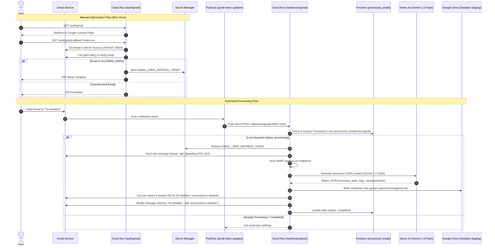

# Implementation Plan: Event-Driven Gmail Ingestion & LLM Processing Engine

This document outlines the step-by-step implementation plan for extending the existing **plaud_processor** architecture to support near-real-time Gmail ingestion, Vertex AI (Gemini 1.5 Flash) parsing, and Google Drive delivery.

---

## 1. System Architecture & Data Flow

The extension introduces a secondary push-based ingestion source (Gmail) alongside the existing folder-based ingestion (Plaud Staging).



---

## 2. Prerequisites & Assumptions

1. **Workspace:** Files must be edited under `/home/napier/a/ObsidianWorkspace/plaud_processor`.
2. **Infrastructure Environment:** Single production GCP environment.
3. **Google API Scopes:** Scopes required for the User Consent flow:
   - `https://www.googleapis.com/auth/gmail.readonly` (for reading messages)
   - `https://www.googleapis.com/auth/gmail.modify` (for managing/swapping labels)
4. **Vertex AI Credentials:** Default credentials from the `app-runner` service account using the `roles/aiplatform.user` IAM role.

---

## 3. Detailed Phase-by-Phase Plan

### Phase 1: Infrastructure & Secret Management (Terraform)
We will expand the Terraform configuration to provision the necessary Google Cloud resources, IAM permissions, and secrets.

#### File Modifications:
1. **`terraform/main.tf`**:
   - Enable `secretmanager.googleapis.com` and `aiplatform.googleapis.com` APIs.
   - Define the three new Secret Manager resources:
     ```hcl
     resource "google_secret_manager_secret" "gmail_client_id" {
       secret_id = "GMAIL_CLIENT_ID"
       replication {
         auto {}
       }
     }

     resource "google_secret_manager_secret" "gmail_client_secret" {
       secret_id = "GMAIL_CLIENT_SECRET"
       replication {
         auto {}
       }
     }

     resource "google_secret_manager_secret" "gmail_user_refresh_token" {
       secret_id = "GMAIL_USER_REFRESH_TOKEN"
       replication {
         auto {}
       }
     }
     ```
   - Update the `google_cloud_run_v2_service.default` container definition to:
     - Add environment variable `ALLOWED_EMAIL`.
     - Mount the client ID, secret, and refresh token as environment variables from Secret Manager:
       ```hcl
       env {
         name = "GMAIL_CLIENT_ID"
         value_source {
           secret_key_ref {
             secret  = google_secret_manager_secret.gmail_client_id.secret_id
             version = "latest"
           }
         }
       }
       env {
         name = "GMAIL_CLIENT_SECRET"
         value_source {
           secret_key_ref {
             secret  = google_secret_manager_secret.gmail_client_secret.secret_id
             version = "latest"
           }
         }
       }
       env {
         name = "GMAIL_USER_REFRESH_TOKEN"
         value_source {
           secret_key_ref {
             secret  = google_secret_manager_secret.gmail_user_refresh_token.secret_id
             version = "latest"
           }
         }
       }
       ```
2. **`terraform/iam.tf`**:
   - Add IAM bindings for the `app-runner` service account to access Secret Manager:
     - `roles/secretmanager.secretAccessor` (access client ID, secret, refresh token)
     - `roles/secretmanager.secretVersionAdder` (allow OAuth callback to update refresh token)
   - Add IAM binding for Vertex AI:
     - `roles/aiplatform.user` (allow calling Gemini models via Vertex AI SDK)
3. **`terraform/pubsub.tf`**:
   - Add Pub/Sub Topic `gmail-inbox-updates`.
   - Add push subscription `gmail-inbox-updates-sub` targeting `${google_cloud_run_v2_service.default.uri}/webhooks/gmail` with an OIDC token configuration using `pubsub-invoker`.
   - Grant `roles/pubsub.publisher` on `gmail-inbox-updates` to `serviceAccount:gmail-api-push@system.gserviceaccount.com`.

---

### Phase 2: Application Dependencies & Setup
Add the necessary NPM libraries for MIME parsing and Vertex AI integration.

#### File Modifications:
1. **`app/package.json`**:
   - Add `@google/genai` to `dependencies` (unified Google GenAI SDK).
   - Add `mailparser` to `dependencies` (for clean email stream processing).
   - Add `@types/mailparser` to `devDependencies`.

---

### Phase 3: OAuth 2.0 & Access Guard (Node.js/TypeScript)
Implement the handlers for programmatic token authorization and verification.

#### File Modifications:
1. **`app/src/index.ts`**:
   - Create router paths for authorization:
     - **`GET /auth/gmail`**: Initializes `google.auth.OAuth2` using the configuration loaded from environment variables (`GMAIL_CLIENT_ID`, `GMAIL_CLIENT_SECRET`) and the redirect URI `https://${process.env.DOMAIN_NAME}/auth/gmail/callback`. Generates the auth URL requesting scopes, offline access, and consent prompt.
     - **`GET /auth/gmail/callback`**:
       1. Captures authorization code from the query string.
       2. Exchanges code for tokens.
       3. Queries `gmail.users.getProfile({ userId: 'me' })`.
       4. Checks if the returned email matches `process.env.ALLOWED_EMAIL`.
       5. If yes, writes the refresh token to GCP Secret Manager (`GMAIL_USER_REFRESH_TOKEN`).
       6. If no, aborts with a `403 Forbidden` response.

---

### Phase 4: Watch Renewal Extension & Label Inception
Expand watch renewal scheduling to keep Gmail's subscription channel alive alongside Google Drive, and ensure the target labels exist.

#### File Modifications:
1. **`app/src/index.ts` (inside `POST /renew-watch`)**:
   - Initialize the authorized Gmail client using the stored refresh token.
   - **Label Resolution/Creation Helper:**
     - Query `gmail.users.labels.list({ userId: 'me' })` to retrieve all existing labels.
     - Look for label name `!to-obsidian`.
     - If `!to-obsidian` does not exist, call `gmail.users.labels.create({ userId: 'me', requestBody: { name: '!to-obsidian' } })` to create it.
     - Extract and use the returned label ID (e.g. `Label_XXX`).
   - Execute `gmail.users.watch` targeting `projects/<project-id>/topics/gmail-inbox-updates` passing the resolved Label ID in `labelIds: [resolvedToObsidianId]`.
   - Log the resulting `historyId` and the renewal execution for monitoring.

---

### Phase 5: Webhook processing Route & Gemini Integration
This is the core business logic handler that receives notifications, parses emails, formats using AI, and writes to staging.

#### File Modifications:
1. **`app/src/index.ts`**:
   - Implement **`POST /webhooks/gmail`**:
     - Verify OIDC token signature using `verifyOidcToken` to restrict access to Pub/Sub push invocations.
     - Parse the incoming base64 Pub/Sub payload.
     - Initialize authorized Gmail client.
     - Query `gmail.users.messages.list` with query `label:!to-obsidian`.
     - For each message:
       - Run a Firestore transaction on `processed_emails/{messageId}`. If the document exists with status `processing` or `completed`, skip it. Otherwise, create/update status to `processing`.
       - Retrieve raw RFC 822 format:
         `gmail.users.messages.get({ id: messageId, format: 'raw' })`
         *Implementation Note:* Using `format: 'raw'` returns a base64url-encoded MIME string which can be decoded into a Buffer and parsed with `mailparser`'s `simpleParser` cleaner than reconstructing from nested `format: 'full'` JSON parts.
       - Decode MIME content using `simpleParser` to extract sender, subject, date, body, and threadId.
       - Initialize the `@google/genai` Vertex AI client:
         ```typescript
         import { GoogleGenAI } from '@google/genai';
         const ai = new GoogleGenAI({
           vertexAI: {
             project: process.env.PROJECT_ID,
             location: process.env.GCP_REGION || 'us-central1'
           }
         });
         ```
       - Query **Gemini 1.5 Flash** with the strict JSON output schema.
         ```typescript
         const response = await ai.models.generateContent({
           model: 'gemini-1.5-flash',
           contents: prompt,
           config: {
             responseMimeType: 'application/json',
             responseSchema: responseSchema
           }
         });
         ```
       - Compile the output markdown file using the required template.
       - Add the generated note to the Google Drive `Obsidian Staging` folder as `gmail-capture-${messageId}.md`.
       - Swap labels on the thread:
         *API Caveat:* The Gmail API requires label IDs instead of names for modification. We must:
         1. Call `gmail.users.labels.list` to retrieve user-created labels.
         2. Locate the ID matching `!to-obsidian` and `processed-to-obsidian`. If `processed-to-obsidian` is missing, call `gmail.users.labels.create` to initialize it.
         3. Call `gmail.users.messages.modify` passing the resolved IDs to `removeLabelIds` and `addLabelIds`.
       - Set Firestore status to `completed`.

---

## 4. Key Risks & Mitigations

| Risk | Impact | Mitigation Strategy |
| :--- | :--- | :--- |
| **Gmail OAuth Token Expiration** | Fatal | By explicitly requesting `access_type: 'offline'` and `prompt: 'consent'` during the handshake, Google returns a permanent refresh token which is safely stored in Secret Manager and reused. |
| **Label ID Mapping Resolution** | High | Unlike system labels (`INBOX`), custom labels (`!to-obsidian`) do not have predefined IDs. The Node.js code will query `labels.list` to resolve names to IDs and auto-create labels if they are missing. |
| **Pub/Sub Retry Loop & Concurrency** | Medium | Pub/Sub retry backoffs can run concurrently. A Firestore transaction lock is established on the unique `messageId` before retrieval to guarantee exactly-once processing. |
| **Large/MIME-Complex Emails** | Low | Rich HTML formatting or embedded attachments may bloat raw payloads. The plan utilizes `mailparser`'s robust MIME-decoding logic to extract clean plain text. |
| **Vertex AI API Quotas** | Low | Standard limits on Gemini 1.5 Flash on Vertex AI easily cover personal ingestion rates. In the case of temporary GCP outages, Pub/Sub's dead-letter-queue (DLQ) will capture failing messages for retrying. |

---

## 5. Verification & Testing Plan

### Step 1: Local Lint & Compile Check
Run compile checks locally before deploying:
```bash
cd app
npm install
npm run build
```

### Step 2: Deployment Verification
Confirm the CI/CD pipeline pushes infrastructure updates and deploys the new endpoints.
Verify:
1. Secret Manager secrets exist.
2. Pub/Sub subscription `gmail-inbox-updates-sub` points to the correct URL endpoint.
3. Service Account IAM roles (`aiplatform.user`, `secretmanager.secretAccessor`, `secretmanager.secretVersionAdder`) are bound.

### Step 3: OAuth Handshake Simulation
1. Navigate to `https://<domain>/auth/gmail`.
2. Authorize using an email **other** than the defined `ALLOWED_EMAIL` -> verify a `403 Forbidden` is returned and `GMAIL_USER_REFRESH_TOKEN` remains empty.
3. Repeat authorization with `ALLOWED_EMAIL` -> verify `200 Success` and check that the secret value in Secret Manager is populated.

### Step 4: Webhook Simulation
1. Trigger `/renew-watch` -> verify in GCP logs that both Google Drive and Gmail watch updates execute successfully and that the `!to-obsidian` label exists in your Gmail account.
2. Manually label a test email with `!to-obsidian`.
3. Check Cloud Run logs to trace:
   - Webhook trigger on `/webhooks/gmail`.
   - Firestore lock write.
   - Text parsing and Vertex AI generation.
   - File creation in the Google Drive `Obsidian Staging` folder.
   - Gmail label migration to `processed-to-obsidian`.
4. Ensure downstream Plaud worker detects the staged file, processes headers, and routes it to `Obsidian Vault`.
